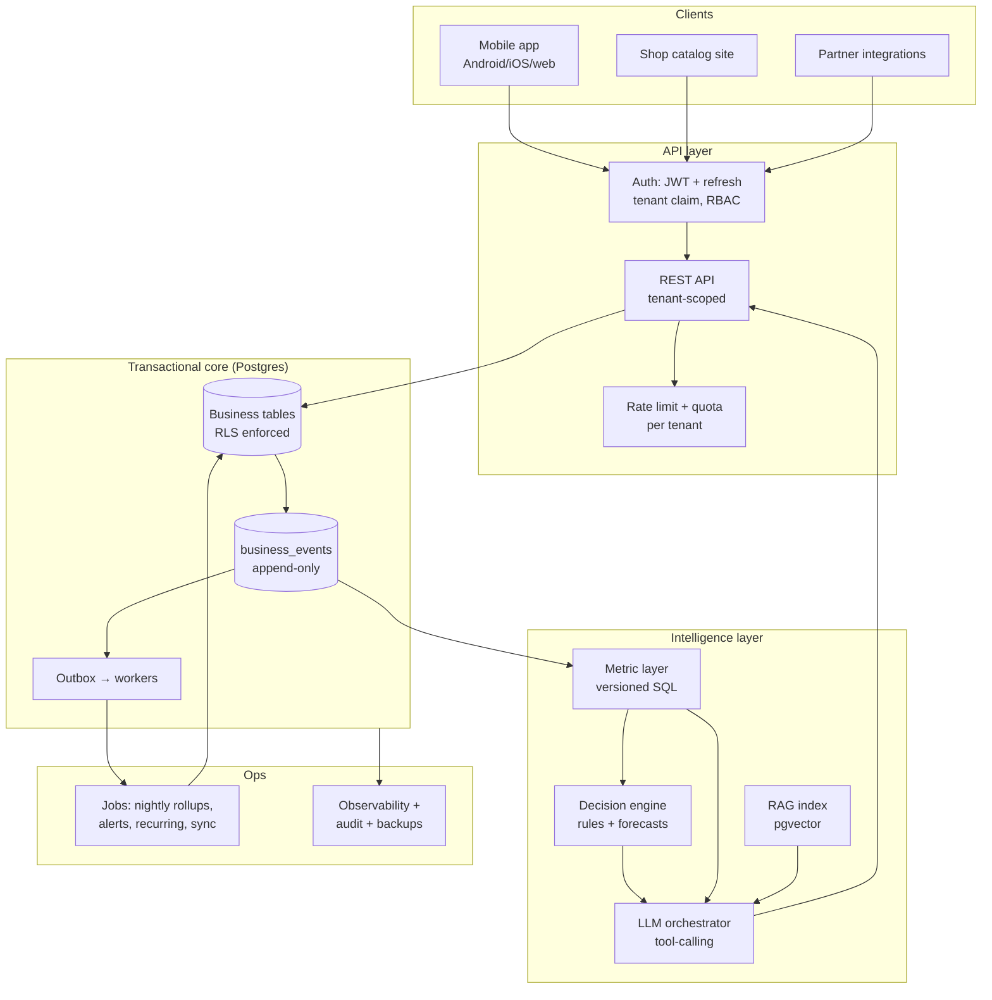

# FastBill — Target Architecture: Multi-Tenant SaaS with AI Decision-Making at the Core

**Written 2026-08-01. Design document — nothing here is built yet.**

Goal: FastBill becomes a proper multi-tenant SaaS where **AI and data analytics are the product**, not a feature bolted on. Every subscribing business owner gets decisions — what to restock, who not to give udhari to, what to price, where money is leaking — grounded in their own data, in their own language.

This document is written against the system as it actually exists (see `AI_HANDOFF.md`, verified 2026-07-29). It is deliberately **incremental**: every phase ships something, and there is no point at which the app must be rewritten.

---

## 0. The one design rule everything else follows

> **Numbers are computed by SQL. Language is generated by the LLM. These never swap jobs.**

This rule already exists in the daily-briefing code and it is the most valuable decision in the codebase. If an LLM ever computes a shopkeeper's revenue, outstanding, or GST liability, the product is finished — one confidently wrong number in front of a shopkeeper's customer destroys trust permanently, and it will not be recoverable by an apology.

So: a deterministic **metric layer** owns every figure. The LLM decides *which* metrics to ask for, *what they mean together*, and *how to say it in Bhojpuri-inflected Hindi*. It never does arithmetic.

---

## 1. Target architecture



Six layers, each with one job:

1. **Clients** — mobile app, per-shop catalog site, partner integrations. None of them ever touch the database directly.
2. **API layer** — authentication, tenant resolution, authorisation, quotas. The only door into the data.
3. **Transactional core** — Postgres with row-level security, plus an append-only event log.
4. **Intelligence layer** — metric definitions, a decision engine, a retrieval index, and an LLM orchestrator that can only reach data through the metric layer.
5. **Jobs** — nightly rollups, alert generation, recurring invoices, channel sync.
6. **Ops** — observability, audit, backups, cost control.

---

## 2. Multi-tenancy — the first thing that must change

**Today:** the client holds the Supabase anon key, RLS is disabled on every table, and `shopId` in a request body is the only identity. Any person who learns a shop's UUID can read and write that shop. This is survivable for a supervised pilot and is disqualifying for a paid SaaS.

**Target:** shared database, shared schema, **row-level security keyed to a tenant claim in a JWT**.

- Every business table carries `shop_id` (most already do) and gets an RLS policy: `shop_id = auth.tenant_id()`.
- The client never gets a database key. It gets a **short-lived JWT** (say 30 minutes) plus a refresh token, issued by the API on phone+PIN login. The token carries `shop_id`, `staff_id`, role and permissions.
- The API uses a service-role connection and sets the tenant context per request, so RLS is enforced **inside the database** — a missed `WHERE shop_id = ...` in application code becomes harmless instead of a cross-tenant leak. Today that check is hand-written in ~60 endpoints and has already been forgotten once (`update_inventory_after_invoice` still filters only on `design_id`).

**Rejected alternative — database per tenant.** Strong isolation, but migrations, connection pooling, cost and cross-tenant analytics all get much harder, and it is unnecessary below roughly ten thousand tenants. Shared schema + RLS is the right choice for years.

**Why this is phase one:** every later idea — benchmarks, partner APIs, AI over shop data — makes tenant isolation more consequential. Building on the current foundation means retrofitting security under live customers, which is the worst possible time.

---

## 3. The event log — the actual data moat

Add one append-only table, and treat it as the spine of the system:

```
business_events
  id, shop_id, occurred_at, actor (staff/system/channel),
  event_type  -- sale.created, payment.received, stock.adjusted,
              -- purchase.recorded, credit.extended, price.changed, ...
  entity_type, entity_id,
  payload  jsonb,
  amount, quantity        -- promoted for cheap aggregation
```

Every state change writes a row here in the same transaction as the change itself. Nothing ever updates or deletes a row.

This single table delivers five things that are otherwise five separate projects:

- **Audit trail** — who changed what, when. Currently missing outside payments; a support necessity the moment staff accounts and multiple channels write to the same stock.
- **Analytics source** — trends, cohorts, velocity all come from replaying events, without heavy joins on transactional tables.
- **AI context** — a shop's history in one uniform shape, easy to summarise and index.
- **Sync outbox** — channel connectors and webhooks read from the log with an ordered cursor, giving retryable, ordered delivery for free.
- **The cross-tenant moat** — aggregated, anonymised patterns across thousands of shops (see §7), which no single-shop competitor can ever assemble.

Retention: keep raw events hot for around 24 months, then roll up and archive. Partition by month from day one — retrofitting partitioning on a large table is painful.

---

## 4. The metric layer — one definition of every number

The problem this solves: today "revenue" is computed in at least four places — dashboard, tax summary, briefing, analytics — each with slightly different filters for cancelled and returned invoices. As soon as an AI can be *asked* about revenue, those inconsistencies become visible contradictions.

**Design:** a versioned catalogue of metrics, each defined exactly once as SQL, with declared dimensions, filters and grain.

```
metric: net_sales
  grain: day | week | month | fy
  dimensions: channel, customer, category, staff
  definition: sum(invoice gross) where status not in (cancelled, returned)
  currency: INR, timezone: Asia/Kolkata
```

Everything reads from here: the app's dashboard, the tax screen, the decision engine, and the AI. One definition, one answer, everywhere.

Two implementation notes that matter more than they sound:
- **IST is part of the definition.** Every date bucket carries `+05:30` explicitly. Two real bugs have already come from naive UTC.
- **Metrics are versioned.** When a definition changes, old answers must stay explainable — a shopkeeper who screenshots last month's figure will ask why it moved.

Pre-computed nightly rollups (`shop_id × metric × period`) make the dashboard and the AI both fast and cheap. Live queries only for today's partial data.

---

## 5. The decision engine — where the actual value is

This is the part that makes it a decision product rather than a reporting product. **Almost none of it is an LLM.** Statistics and rules, run nightly, producing typed *recommendations*:

| Decision | Method | Output to the shopkeeper |
|---|---|---|
| Restock what, how much, when | Consumption velocity + lead time + safety stock | "Order 40 boxes of VT-001 by Friday — 9 days of stock left, supplier takes 6" |
| Dead stock | No movement in N days × capital tied up | "₹47,000 is stuck in 12 items unsold for 90 days" |
| Credit risk before giving udhari | Customer payment history, current exposure, ageing | "Ramesh already owes ₹18,000 and pays 22 days late on average" |
| Cash-flow forecast | Receivables ageing + payables due + seasonality | "Next Thursday you may fall ₹22,000 short" |
| Margin leakage | Selling price vs landed cost per item | "You are selling 3 items below cost after transport" |
| Price suggestion | Cost + margin target + local benchmark | "Similar shops charge 8% more for this category" |
| Expiry loss prevention | Expiry date vs velocity | "Clear these 6 items this week or lose ₹3,200" |
| Collection priority | Amount × age × payment behaviour | "Chase these 3 customers first — ₹31,000, most likely to pay" |
| Anomalies | Deviation from the shop's own baseline | "Today's cash is 40% below a normal Tuesday" |

Each recommendation is a row: what, why (the numbers behind it), confidence, expected rupee impact, and the action that would follow. **The LLM's only job is to say it in the shopkeeper's language and hold a conversation about it.**

Then the loop that compounds: **every recommendation records whether it was acted on and what happened.** Accepted or ignored, and did the outcome match. That is how the engine gets better, how you learn which advice is worth showing, and how you eventually prove ROI in a sales conversation — "shops that follow restock advice hold 18% less dead stock". The `feedback` table already built for the pilot is the seed of this.

---

## 6. The AI layer

**Orchestrator with tools, not a prompt with a database dump.**

The LLM receives: the shop's profile, the current recommendation set, the conversation, and a set of **tools** — `get_metric(name, period, filters)`, `list_recommendations()`, `search_history(query)`, `explain_number(metric, period)`. It cannot write SQL, cannot reach another tenant's data, and cannot see raw tables.

**RAG** via pgvector in the same Postgres — indexing per-shop summaries, product catalogue text and past advice. A separate vector database is unjustified at this scale.

**Guardrails that are not optional:**
- Every number in an answer must come from a tool result and be traceable to a metric and period. If a tool did not return it, the model may not state it.
- PII is redacted before any prompt leaves the system; customer phone numbers and names are not needed for advice.
- **Hard tenant isolation in the prompt path** — a bug that leaks one shop's data into another's answer is an existential event for a business product, so tenant scoping belongs in the tool implementation, not in prompt instructions.
- Deterministic fallback whenever the model is unavailable or over quota. Already the pattern in the briefing endpoint; keep it everywhere.
- Per-tenant token budgets and aggressive caching — the briefing is identical for a shop all day, so generate once and reuse.

**Model strategy:** cheap, fast model for narration and routine briefings; a stronger model only for genuine reasoning and long conversations. Route by task, not by habit. Keep the provider swappable behind one interface — the codebase has already been burned once by an SDK breaking in production and had to migrate everything to a different provider in a hurry.

**Do not fine-tune early.** A fine-tune fixes tone, not correctness, and correctness lives in the metric layer. Revisit only when there is a large corpus of accepted-advice pairs and a real eval harness.

**Evaluation:** a golden set of questions per shop type with known-correct answers computed from the metric layer, run on every prompt or model change. Without this, every model upgrade is a coin flip on a live business.

---

## 7. Cross-tenant intelligence — the moat, handled carefully

With thousands of shops, aggregate patterns become genuinely valuable: category demand by region and season, price benchmarks, festival demand curves, supplier reliability, typical credit-cycle length by trade. No single-shop product can ever produce this, and it makes the AI advice materially better than "here is your own data restated".

Rules, and they are not negotiable:
- **Opt-in, stated plainly** in the subscription terms — in the user's language, not buried in English legalese.
- **Aggregate only, with k-anonymity** — never surface a cell derived from fewer than, say, 20 shops. A shopkeeper must never be able to infer a specific competitor's numbers.
- **No raw cross-tenant data ever enters a prompt.** Benchmarks enter as pre-computed aggregate metrics, exactly like any other metric.
- **Contractually clear ownership** — the shop owns its data; BAE holds a licence to use anonymised aggregates. Under the DPDP Act this needs real consent, deletion on request, and breach reporting.

This is worth building deliberately and slowly. Done well it is a compounding advantage; done carelessly it is a privacy incident that ends the company.

---

## 8. SaaS platform mechanics

None of this is glamorous and all of it is required before charging anyone.

- **Plans and entitlements** — features gated by a plan flag checked server-side, not by hiding buttons in the app. Staff permissions already proved this lesson.
- **Metering** — AI calls, channel syncs, storage. Needed for pricing that does not lose money on the heaviest users.
- **Subscription lifecycle** — trial, active, past-due, grace period, suspended, cancelled. Critically: **suspension must never lock a shopkeeper out of their own historical data**, or the product becomes hostage-taking and a support catastrophe.
- **Data export and portability** — the shop can take everything out, any time, in a readable format. Also the honest answer to "what if you shut down", which every serious buyer asks.
- **Onboarding and migration** — importing an existing product list from a spreadsheet or from Tally is the single biggest adoption blocker in this market.
- **Prerequisites already known and still open:** an entity (LLP), bank account, payment gateway, GST registration, ToS/Privacy/DPA. These block all revenue regardless of architecture.

## 9. Operations

- **A staging environment.** Right now the mobile app points at production and there is nowhere to test a migration. This is the cheapest high-value fix available.
- **Backups with a tested restore.** An untested backup is not a backup. Free-tier Postgres has no point-in-time recovery; when a shop's whole business is inside FastBill, this becomes a commercial requirement, not a preference.
- **Migrations** — forward-only, reversible where possible, applied through CI rather than by pasting SQL into a dashboard. The current process (a human running SQL by hand) does not survive multiple tenants.
- **Observability** — error tracking, latency and error-rate alerts, per-tenant health. Today a shop's failure is discovered when the shopkeeper phones.
- **Cost controls** — the AI bill scales with usage, so per-tenant budgets and caching are architecture, not accounting.

---

## 10. Sequencing

Each phase ships something usable. Nothing here requires a rewrite.

| Phase | Content | Rough effort |
|---|---|---|
| **P0** | Finish the pilot. Learn what shopkeepers actually want before building any of this. | in progress |
| **P1 — Trust foundation** | JWT sessions + RLS + kill the anon key in the client; staging environment; backups with a tested restore; audit via `business_events`; data export | 4–6 weeks |
| **P2 — Metric layer** | Extract every metric definition into one versioned catalogue; nightly rollups; migrate dashboard, tax, briefing and analytics to read from it | 3–4 weeks |
| **P3 — Decision engine** | Restock, dead stock, credit risk, cash-flow forecast, expiry, collection priority, anomalies + the accept/ignore/outcome feedback loop | 4–6 weeks |
| **P4 — AI orchestrator** | Tool-calling over metrics, RAG on pgvector, guardrails, eval harness, caching and budgets | 3–4 weeks |
| **P5 — SaaS mechanics** | Plans, entitlements, metering, subscription lifecycle, onboarding import | 3–4 weeks |
| **P6 — Benchmarks** | Opt-in cross-tenant aggregates with k-anonymity | 2–3 weeks |
| **P7 — Channels** | Everything in `OMNICHANNEL_PLAN.md`, which assumes P1 is done | see that document |

Roughly **five to seven months** of focused solo work with AI assistance, assuming the pilot validates the direction. P1 and P2 are worth doing even if every later idea is abandoned — they are correctness and trust fixes in the current product.

---

## 11. What this architecture deliberately does *not* do

- **No microservices.** One API, one database, background workers. Distributed systems buy scale that does not exist and cost debugging capacity that a solo founder cannot spare.
- **No data warehouse yet.** Postgres with rollups and partitioning handles millions of events comfortably. Move to a columnar store when queries actually hurt — not before.
- **No separate vector database.** pgvector in the same Postgres.
- **No Kubernetes.** Managed hosting until it is genuinely the bottleneck.
- **No fine-tuned model.** Correctness comes from the metric layer.
- **No rewrite.** Every phase is additive on top of the existing Express + Supabase + Expo stack.

The architecture that wins here is not the sophisticated one — it is the one a single person can operate correctly at 3 a.m. while shops are billing.

---

## 12. The strategic bet, stated plainly

Billing apps are a commodity in India. Vyapar, Marg, Tally and a dozen others do invoicing well, and FastBill will not out-feature them.

What none of them do is **tell a shopkeeper what to do next, in their own language, from their own data.** That requires exactly what this architecture is built for: a clean event log, one honest definition of every number, a decision engine that produces rupee-denominated recommendations, an LLM confined to language rather than arithmetic, and — eventually — aggregate intelligence across thousands of shops that no single-shop product can replicate.

The competitive question is not "does FastBill have more features". It is: **when a shopkeeper opens the app in the morning, does it tell them something true and useful that they did not already know?** Everything above exists to make that answer yes, reliably, for a few thousand shops at once.

---

*Related: `AI_HANDOFF.md` (current system, verified 2026-07-29) · `BUSINESS_TECH_REQUIREMENTS.md` (capability gaps) · `OMNICHANNEL_PLAN.md` (channels) · `SAP_COMPARISON.md` (positioning) · `PHASE2_S2_S3_before_paid_launch.sql` (atomic-invoice RPC, written, not applied).*
